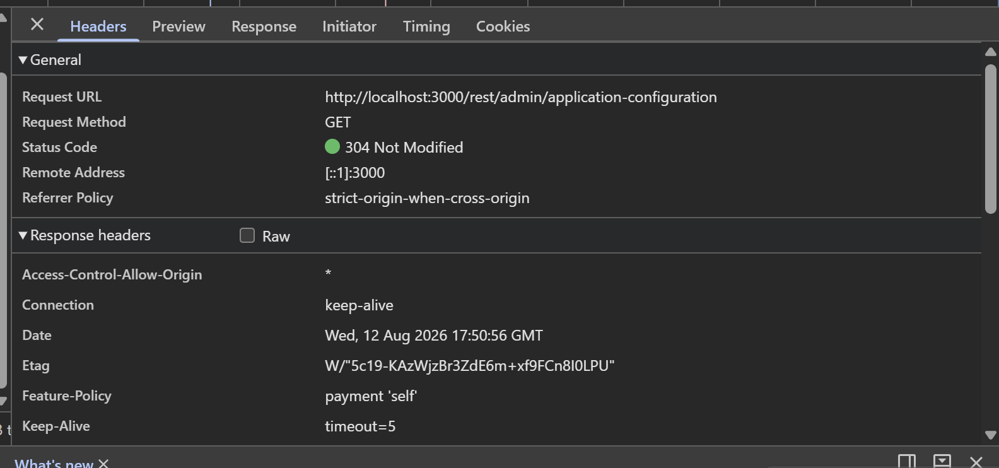
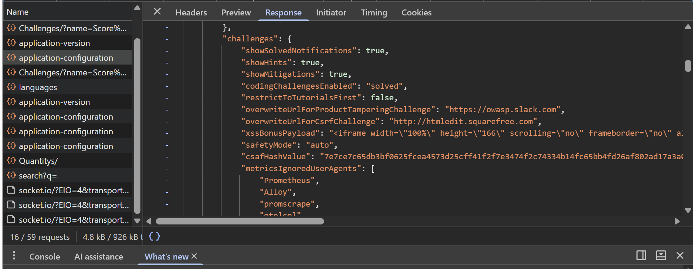

\# Phase 4 – Vulnerability Analysis \& OWASP Mapping

\## Objective

The objective of this phase is to analyze security weaknesses identified during testing of the intentionally vulnerable OWASP Juice Shop application running inside the cybersecurity home lab.

The findings will be evaluated based on their potential security impact and mapped to relevant OWASP Top 10 categories. Remediation recommendations will also be documented to demonstrate how the identified risks could be reduced in a real-world environment.

\## Lab Scope

\- Target Application: OWASP Juice Shop

\- Environment: Local Docker container

\- Testing Environment: Isolated cybersecurity home lab

\- Testing Purpose: Educational and authorized security testing

\- Analysis Focus: Web application vulnerabilities, security misconfigurations, authentication weaknesses, and information exposure

\## Methodology

1\. Review information collected during application enumeration.

2\. Identify potential security weaknesses.

3\. Validate findings within the authorized lab environment.

4\. Determine the potential security impact.

5\. Map findings to relevant OWASP Top 10 categories.

6\. Assign an appropriate severity level.

7\. Document recommended remediation measures.

8\. Preserve screenshots and technical evidence for each validated finding.

## Finding 01 – Application Configuration Information Exposure

**Severity:** Medium  
**Endpoint:** `/rest/admin/application-configuration`  
**HTTP Method:** GET  
**OWASP Mapping:** A05:2021 – Security Misconfiguration

### Description

During analysis of the OWASP Juice Shop application, browser network traffic revealed a request to the `/rest/admin/application-configuration` endpoint.

The endpoint returned application configuration information to the client. The response contained internal application settings, challenge-related configuration, security-related values, and other implementation details.

Exposing unnecessary internal configuration information can provide an attacker with additional knowledge about an application's architecture, security controls, and functionality.

### Evidence

The request was observed using Chrome Developer Tools during authorized testing of the local OWASP Juice Shop environment.

The response exposed application configuration information to the browser.

### Security Impact

Information disclosure can assist an attacker during reconnaissance by revealing implementation details that may help identify additional attack paths or weaknesses.

Although the exposed information does not by itself demonstrate complete system compromise, unnecessary exposure of administrative or security-related configuration increases the application's attack surface.

### Remediation

- Restrict administrative configuration endpoints to authorized users where appropriate.
- Avoid returning unnecessary internal configuration information to client applications.
- Review API responses and remove security-sensitive or implementation-specific values that are not required by the frontend.
- Apply server-side authorization controls to sensitive administrative endpoints.
- Follow the principle of least privilege when exposing application data through APIs.

### Validation

The finding was reproduced in an isolated local Docker environment running OWASP Juice Shop. No external or production systems were tested.