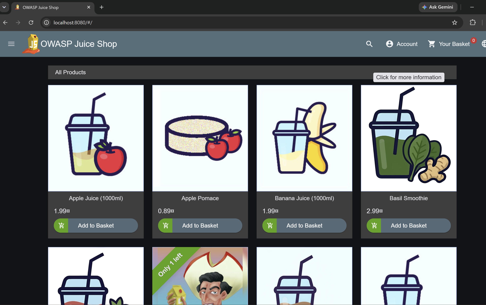
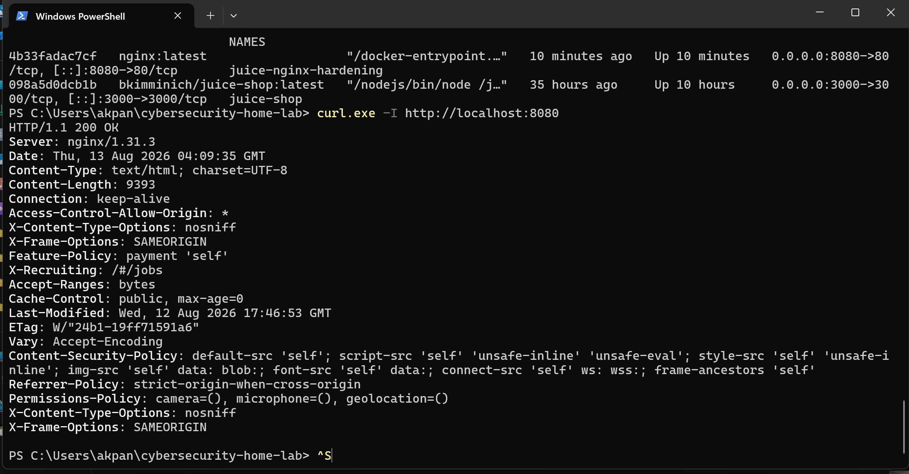

# Phase 5 – Remediation and Security Hardening Lab

## Objective

The objective of Phase 5 was to move beyond vulnerability identification and implement defensive security controls against the HTTP security-header weaknesses identified during Phase 4.

Rather than modifying the OWASP Juice Shop source code, an NGINX reverse proxy was deployed as a security layer in front of the application.

This demonstrated how compensating security controls can be implemented at the web infrastructure layer.

---

## Lab Environment

The lab was performed in an isolated local environment.

Technologies used:

- Docker Desktop
- OWASP Juice Shop
- NGINX
- Windows PowerShell
- curl
- Git
- GitHub

OWASP Juice Shop was running locally on:

`http://localhost:3000`

The hardened NGINX endpoint was configured on:

`http://localhost:8080`

No external or production systems were tested.

---

## Phase 4 Baseline

HTTP response headers from the original Juice Shop application were inspected using curl.

Command used:

`curl.exe -I http://localhost:3000`

A targeted header inspection was also performed.

The baseline assessment confirmed the presence of:

- X-Content-Type-Options: nosniff
- X-Frame-Options: SAMEORIGIN

The targeted assessment did not identify the following headers:

- Content-Security-Policy
- Referrer-Policy
- Permissions-Policy

These results provided the baseline for the Phase 5 remediation lab.

---

## Remediation Strategy

An NGINX reverse proxy was deployed between the browser and OWASP Juice Shop.

Architecture:

Browser → NGINX Reverse Proxy :8080 → OWASP Juice Shop :3000

The reverse proxy was configured to add additional HTTP security controls without modifying the Juice Shop application itself.

---

## Security Controls Implemented

### Content Security Policy

A Content-Security-Policy header was introduced to restrict the sources from which browser resources may be loaded.

The policy also included the `frame-ancestors` directive to provide additional protection against unauthorized framing.

### Referrer Policy

The following policy was implemented:

`Referrer-Policy: strict-origin-when-cross-origin`

This limits the amount of referrer information transmitted during cross-origin requests.

### Permissions Policy

The following browser capabilities were restricted:

- Camera
- Microphone
- Geolocation

Configuration:

`Permissions-Policy: camera=(), microphone=(), geolocation=()`

### MIME-Type Protection

The deployment retained:

`X-Content-Type-Options: nosniff`

This helps prevent MIME-type sniffing.

### Frame Protection

The deployment retained:

`X-Frame-Options: SAMEORIGIN`

This restricts framing of the application by external origins.

---

## Troubleshooting and CSP Adjustment

The initial Content Security Policy was intentionally restrictive.

After the first implementation, OWASP Juice Shop loaded through NGINX but the application's normal styling and interface did not render correctly.

This demonstrated an important security engineering principle:

Security controls must improve security without unnecessarily breaking required application functionality.

The CSP was reviewed and adjusted to support the resources required by the application.

The NGINX configuration was validated and reloaded.

After the adjustment, OWASP Juice Shop rendered correctly through:

`http://localhost:8080`

This confirmed that application functionality had been restored while the additional security headers remained active.

The compatibility-oriented CSP used in this educational lab is not presented as a final production policy. A production CSP should be tightened iteratively based on the application's actual resource requirements.

---

## Verification

The hardened endpoint was tested using:

`curl.exe -I http://localhost:8080`

The application returned:

`HTTP/1.1 200 OK`

The final response contained:

- Content-Security-Policy
- Referrer-Policy
- Permissions-Policy
- X-Content-Type-Options
- X-Frame-Options

Both Docker containers were also confirmed to be operational.

The Juice Shop application remained accessible through the NGINX reverse proxy after the CSP adjustment.

---

## Evidence

### Hardened Application

This screenshot demonstrates OWASP Juice Shop functioning through the NGINX reverse proxy on port 8080.

### Security Header Verification

This screenshot demonstrates the HTTP 200 response and security headers present after the hardening configuration was applied.

---

## Results

Phase 5 successfully demonstrated a complete remediation workflow:

Finding → Baseline → Remediation → Functional Testing → Troubleshooting → Adjustment → Verification

The lab showed that identifying a security weakness is only the beginning of vulnerability management.

Security professionals must also implement controls, verify their effectiveness, evaluate their impact on application functionality, and document the final result.

---

## Skills Demonstrated

- Web application security hardening
- NGINX reverse proxy configuration
- Docker container management
- HTTP security-header analysis
- Content Security Policy implementation
- Security troubleshooting
- Remediation validation
- PowerShell and curl
- Vulnerability management
- Technical documentation
- Git and GitHub evidence management

---

## Key Takeaway

Effective remediation requires balancing security and functionality.

This lab demonstrated how defensive controls can be introduced at the infrastructure layer, tested against an existing application, adjusted when compatibility issues occur, and validated using repeatable technical evidence.